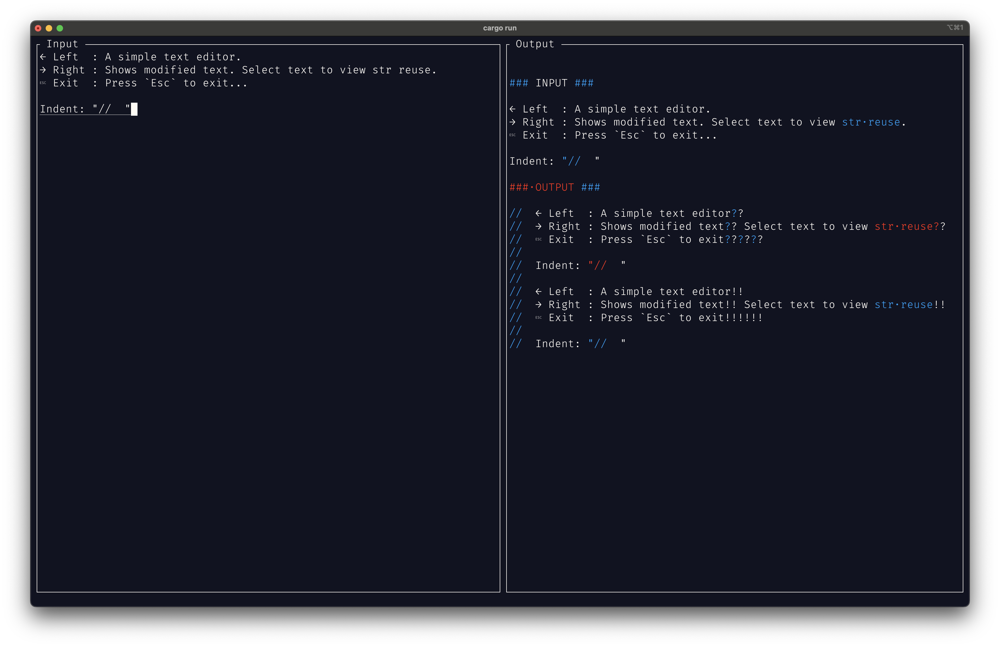

# String Reuse Visualizer

Macros, linters, formatters, error messages, transpilers, etc. all transform source code to similarly structured code. Users and maintainers of these tools may want to understand how output content relates back to input content.

This demo shows how when these tools do a good job of using strings by reference rather than by copying, it becomes easy to show these relations by inspecting the addresses of the content in memory.

### Instructions

Install Rust and run `cargo run`

### Details

The trick is to operate on data structures built up of `&str` slices into the input `String`, rather than building up entirely new `String`s in memory. In this demo, I use a `Vec<&str>` for simplicity, but better data structures exist like [ropes](https://en.wikipedia.org/wiki/Rope_(data_structure)). Operations for concatenation, indexing, slicing, searching, replacing, etc. are implemented without any actual string copying.

It's staightforward to idenfity the locations in memory of individual `char`s within these data structures via some safe pointer artithmetic on the container `&str`s.

A [ratatui](https://ratatui.rs/) interface is provided with a text editor on the left and an interactive debugger on the right.

### Future Experiments

- For cases when new `String`s do need to be allocated, maintain simple address-to-address relations to display which `char`s were inputs to the computation of selected `chars`
